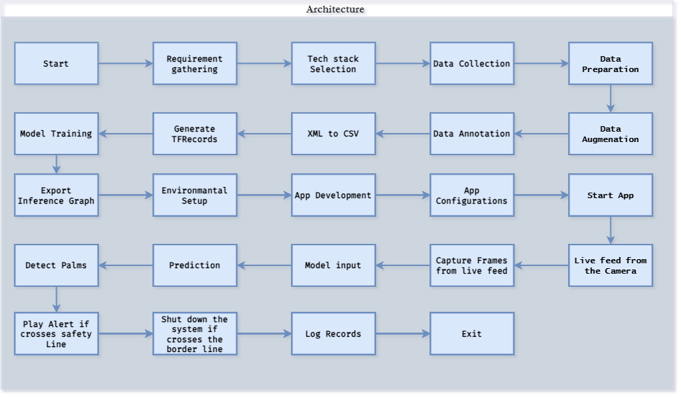
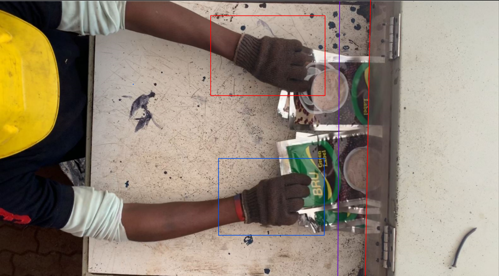

# [SafeGuard Vision Industrial Worker Safety System](https://github.com/Mahesh-martian/SafeGuard-Vision-Industrial-Worker-Safety-System-)

**Table of Contents**

1. Introduction
2. Problem Statement
3. Solution
4. Key Features
5. Usage
6. Examples
7. Safety Benefits
8. Real-World Uses
9. Contributing
10. License
11. Results
12. Workflow
13. Author

### Introduction

Welcome to the Shredder System Safety Enhancement Project README. This project addresses a critical safety concern in heavy industries where workers often operate shredding machines for extended hours. The risk of accidents due to worker fatigue or lapses in attention can result in severe injuries. This system aims to enhance safety by implementing an alert mechanism and automatic shutdown when a worker crosses predefined safety boundaries.

### Problem Statement

In many heavy industries, workers operate shredding machines for long shifts, increasing the risk of accidents. Fatigue, distractions, or lapses in attention can lead to severe injuries, including hand injuries when handling waste material. The problem is to ensure the safety of workers by implementing a mechanism that prevents accidents and minimizes risks associated with machine operation.

### Architecture:


## Installation

**Install my-project with git**

```
  git clone https://github.com/Mahesh-martian/SafeGuard_Vision.git

  cd SafeGuard_Vision
  
  pip install -r requiremenrs.txt

```

**How to Start the application**

`python main.py`

### Solution

The Shredder System Safety Enhancement Project provides a solution to the problem mentioned above. It incorporates a safety boundary alert system that triggers an alarm and automatically shuts down the shredding machine when a worker crosses predefined safety boundaries.

**Key Features**

- Safety Boundary Detection: The system uses sensors and predefined safety boundaries to monitor the worker's position in real-time.
- Alert System: When a worker approaches or crosses a safety boundary, an alert sound is activated, providing a warning to the worker.
- Automatic Shutdown: If a worker crosses the safety boundary, the system initiates an automatic shutdown of the shredding machine, preventing accidents.
- User-Friendly Interface: The system is designed with a user-friendly interface that allows easy configuration of safety boundaries and alerts.

    **Usage**
	To use the [SafeGuard Vision Industrial Worker Safety System](https://github.com/Mahesh-martian/SafeGuard-Vision-Industrial-Worker-Safety-System-):

- Install the system in the industrial setting where shredding machines are operated.
- Configure safety boundaries based on the specific work environment and requirements.
- Ensure that workers are aware of the safety boundaries and the alert system.
- When a worker crosses a safety boundary, an alert will sound, warning them to step back.
- If the worker continues to cross the boundary, the shredding machine will automatically shut down, preventing accidents.


**Example 1: Worker Approaches Safety Boundary**
In this scenario, a worker is operating the shredding machine. As the worker approaches the safety boundary, the system detects their position and triggers an alert sound. The worker promptly steps back to the safe zone.

**Example 2: Worker Crosses Safety Boundary**
In this case, a worker gets distracted and crosses the safety boundary inadvertently. The system responds by activating an alert sound and immediately shutting down the shredding machine, preventing any potential injuries.

**Safety Benefits**
This  System offers several safety benefits:

- Accident Prevention: The system helps prevent accidents and injuries caused by worker fatigue, distraction, or lapses in attention.
- Worker Protection: By automatically shutting down the shredding machine when a safety boundary is crossed, it ensures the safety and protection of workers.
- Reduced Risk: The implementation of this system reduces the risk of serious hand injuries and other accidents in heavy industries.

#### Results



**Contributing**

If you'd like to contribute to the project, please follow our contributing guidelines

**License**
This project is licensed under the MIT License, which means you are free to use and modify it for your specific needs.

#### Author

**Mahesh Kumar R**

- LinkedIn Profile: https://www.linkedin.com/in/mahesh-kumar-r/
- GitHub Profile: https://github.com/Mahesh-martian

If you liked the repo, kindly support it by giving it a star ⭐.
